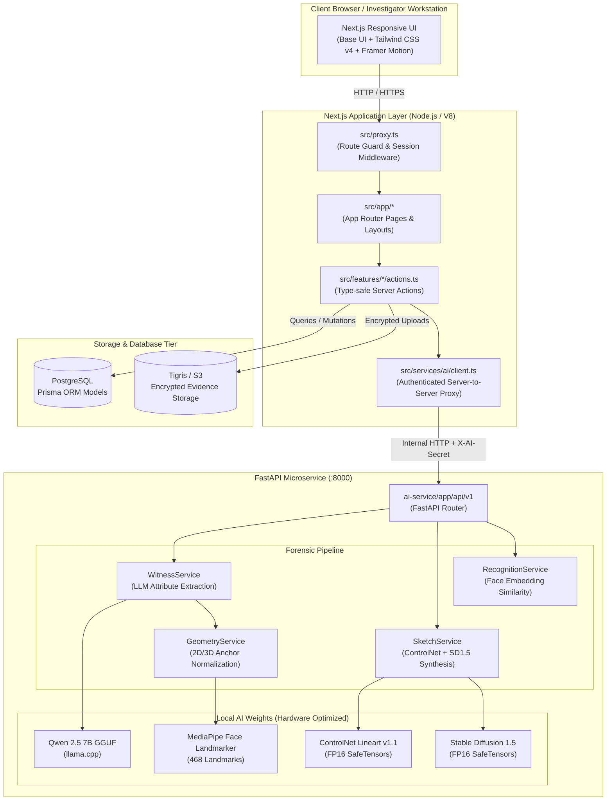
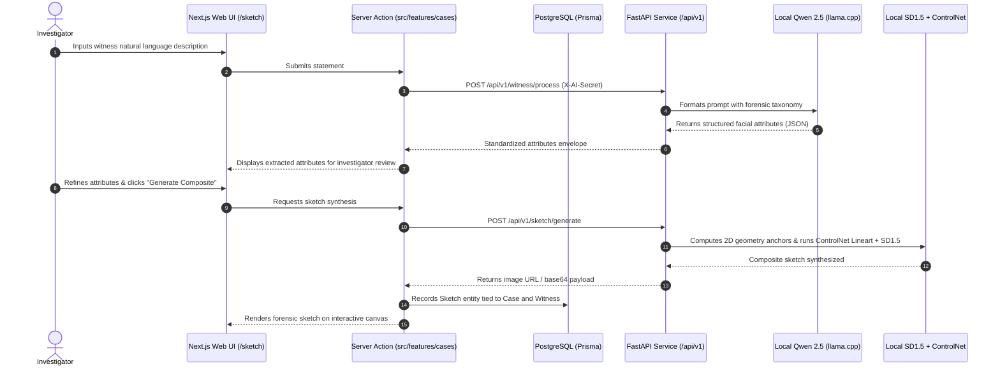

# 🏛️ Forensix (Criminal Eye) — Complete Architecture & Folder Structure

> **Enterprise Forensic Intelligence & AI Composite Synthesis Platform**  
> *A decoupled, dual-stack ecosystem combining a high-performance Next.js 16 App Router application with a localized, hardware-optimized FastAPI AI microservice.*

---

## 📑 Table of Contents

1. [High-Level System Architecture](#-high-level-system-architecture)
2. [Complete Visual Directory Tree](#-complete-visual-directory-tree)
3. [Architectural Layers Breakdown](#-architectural-layers-breakdown)
   - [Next.js Full-Stack Application (`src/`)](#1-nextjs-full-stack-application-src)
     - [App Router & Routing Topology (`src/app`)](#app-router--routing-topology-srcapp)
     - [Features & Vertical Slices (`src/features`)](#features--vertical-slices-srcfeatures)
     - [Component Ecosystem (`src/components`)](#component-ecosystem-srccomponents)
     - [AI Microservice Client & Contracts (`src/services`)](#ai-microservice-client--contracts-srcservices)
     - [Data Schemas & Validation (`src/schemas`)](#data-schemas--validation-srcschemas)
     - [Libraries & Singletons (`src/lib`)](#libraries--singletons-srclib)
     - [Hooks, Utilities & Route Proxy (`src/hooks`, `src/proxy.ts`, `src/env.ts`)](#hooks-utilities--route-proxy)
   - [FastAPI AI Microservice (`ai-service/`)](#2-fastapi-ai-microservice-ai-service)
     - [Application Core (`ai-service/app`)](#application-core-ai-serviceapp)
     - [AI Provider Adapters (`ai-service/app/providers`)](#ai-provider-adapters-ai-serviceappproviders)
     - [Model Weights & Checkpoints (`ai-service/models`)](#model-weights--checkpoints-ai-servicemodels)
     - [Forensic Feature Datasets (`ai-service/datasets`)](#forensic-feature-datasets-ai-servicedatasets)
     - [Test Suite & Automation Scripts (`ai-service/tests`, `ai-service/scripts`)](#test-suite--automation-scripts)
   - [Database & Persistence (`prisma/`)](#3-database--persistence-prisma)
   - [Static Assets & Media Storage (`public/`)](#4-static-assets--media-storage-public)
   - [Root Configuration & AI Agent Tooling](#5-root-configuration--ai-agent-tooling)
4. [Data Flow & Request Lifecycle](#-data-flow--request-lifecycle)
5. [Technology Stack Reference](#-technology-stack-reference)

---

## 🌐 High-Level System Architecture

Forensix is engineered around a secure **Two-Tier Architecture**:
1. **Frontend / Application Server**: Next.js 16 (React 19, Server Actions, Base UI, Better Auth, Prisma ORM).
2. **AI Inference Engine**: Dedicated Python FastAPI microservice with local GPU acceleration (Stable Diffusion 1.5, ControlNet Lineart, Qwen 2.5 7B via llama.cpp, and MediaPipe).



---

## 🌳 Complete Visual Directory Tree

```text
forensix/
├── .agents/                                # AI coding assistant skills, rules, and configurations
│   ├── mcp_config.json                     # Model Context Protocol server registrations
│   └── skills/                             # Custom agent development skill sets
│       ├── migrate-radix-to-base/          # Migration rules from Radix UI to Base UI
│       ├── prisma-composer/                # Prisma Composer guidelines and workflows
│       └── shadcn/                         # Shadcn component management guidelines
├── .claude/                                # Claude IDE workspace skills & rules
├── .cursor/                                # Cursor IDE configuration & AI rules
├── .devin/                                 # Devin AI assistant workspace settings
├── .vscode/                                # VS Code workspace preferences
│   └── settings.json                       # IDE workspace customizations
│
├── ai-service/                             # Dedicated FastAPI Python AI Microservice
│   ├── .cache_downloads/                   # Temporary model weights and cache downloads
│   ├── .env                                # Local Python environment secrets & model paths
│   ├── .env.example                        # Template for Python environment configuration
│   ├── .gitignore                          # Python & Virtualenv ignore rules
│   ├── pyrightconfig.json                  # Python type checker configuration
│   ├── pytest.ini                          # Pytest configuration and CLI defaults
│   ├── README.md                           # Microservice setup, endpoint specs & documentation
│   ├── requirements.txt                    # Python runtime and ML dependencies
│   │
│   ├── app/                                # FastAPI application source package
│   │   ├── __init__.py                     # Package initialization
│   │   ├── main.py                         # Application factory, lifespan, CORS, and middleware
│   │   │
│   │   ├── api/                            # API routing tier
│   │   │   ├── __init__.py
│   │   │   ├── router.py                   # Central v1 endpoint aggregator
│   │   │   └── v1/                         # Version 1 API route controllers
│   │   │       ├── __init__.py
│   │   │       ├── health.py               # Liveness and readiness health checks
│   │   │       ├── recognition.py          # Facial recognition and suspect matching routes
│   │   │       ├── sketch.py               # Forensic sketch generation routes
│   │   │       └── witness.py              # Natural language statement extraction routes
│   │   │
│   │   ├── core/                           # Microservice core cross-cutting concerns
│   │   │   ├── __init__.py
│   │   │   ├── config.py                   # Pydantic BaseSettings (environment config)
│   │   │   ├── logging.py                  # Structured JSON logging & correlation ID tracing
│   │   │   └── security.py                 # Constant-time server-to-server header authentication
│   │   │
│   │   ├── providers/                      # Pluggable AI inference model adapters
│   │   │   ├── __init__.py
│   │   │   ├── base.py                     # Abstract Base Classes (ABC) for providers
│   │   │   ├── face/                       # Face recognition provider implementations
│   │   │   │   ├── __init__.py
│   │   │   │   └── mock.py                 # Mock provider for offline testing & development
│   │   │   ├── llm/                        # LLM statement extraction implementations
│   │   │   │   ├── __init__.py
│   │   │   │   ├── mock.py                 # Mock LLM provider for CI/CD
│   │   │   │   └── qwen_local.py           # Local Qwen2.5-7B GGUF adapter via llama.cpp
│   │   │   └── sketch/                     # Sketch synthesis implementations
│   │   │       ├── __init__.py
│   │   │       ├── diffusion_local.py      # Stable Diffusion 1.5 + ControlNet Lineart provider
│   │   │       └── mock.py                 # Deterministic mock image generator
│   │   │
│   │   ├── schemas/                        # Pydantic V2 data validation models & DTOs
│   │   │   ├── __init__.py
│   │   │   ├── common.py                   # Standard envelope, status codes, and error models
│   │   │   ├── geometry.py                 # 2D/3D coordinate anchors and canvas models
│   │   │   ├── recognition.py              # Candidate suspect match requests and scores
│   │   │   ├── sketch.py                   # Forensic sketch synthesis parameters
│   │   │   └── witness.py                  # Natural language description input & attribute schemas
│   │   │
│   │   ├── services/                       # Business logic and domain pipelines
│   │   │   ├── __init__.py
│   │   │   ├── geometry_service.py         # Semantic feature anchor and coordinate calculator
│   │   │   ├── recognition_service.py      # Face search and suspect similarity orchestration
│   │   │   ├── sketch_service.py           # Sketch generation workflow manager
│   │   │   └── witness_service.py          # Statement parsing and attribute extraction orchestrator
│   │   │
│   │   └── utils/                          # Cross-functional utilities
│   │       ├── __init__.py
│   │       ├── errors.py                   # Custom domain exceptions and HTTP error handlers
│   │       └── files.py                    # Secure path resolution, file writing, and cleaning
│   │
│   ├── datasets/                           # Forensic attribute catalogs and training splits
│   │   ├── components/                     # Categorized composite facial feature templates
│   │   │   ├── eyebrows/                   # Eyebrow shape references (.gitkeep)
│   │   │   ├── eyes/                       # Eye geometry (almond, narrow, round)
│   │   │   ├── face_shapes/                # Facial contour references (.gitkeep)
│   │   │   ├── jaws/                       # Chin and jawline templates (.gitkeep)
│   │   │   ├── mouths/                     # Lip and mouth templates (.gitkeep)
│   │   │   └── noses/                      # Nose structures (broad, narrow, straight)
│   │   ├── FS2K/                           # Forensic Sketch 2000 dataset integration point
│   │   └── metadata/                       # Dataset manifest and train/validation splits
│   │       ├── dataset_manifest.json       # Component taxonomy and metadata dictionary
│   │       └── splits.json                 # Dataset partition declarations
│   │
│   ├── models/                             # Local AI weights, checkpoints, and configs
│   │   ├── controlnet/lineart/             # ControlNet Lineart v1.1 FP16 weights & configuration
│   │   ├── mediapipe/                      # MediaPipe Face Landmarker binary task
│   │   │   └── face_landmarker.task        # 468-point 3D facial landmark mesh model
│   │   ├── qwen/                           # Qwen 2.5 7B quantized model
│   │   │   └── Qwen2.5-7B-Instruct-Q4_K_M.gguf # 4-bit quantized GGUF model for local CPU/GPU execution
│   │   └── sd15/                           # Stable Diffusion v1.5 FP16 local model repository
│   │       ├── feature_extractor/          # Preprocessor configuration
│   │       ├── scheduler/                  # DDIM / Euler Ancestral scheduler configuration
│   │       ├── text_encoder/               # CLIP text encoder FP16 safetensors & config
│   │       ├── tokenizer/                  # Vocabularies, merges, and tokenizer tokens
│   │       ├── unet/                       # UNet FP16 diffusion model safetensors & config
│   │       ├── vae/                        # Autoencoder FP16 weights & configuration
│   │       └── model_index.json            # Diffusers pipeline metadata index
│   │
│   ├── outputs/                            # Microservice output artifact repository
│   │   ├── attributes/                     # Stored JSON attribute extraction payloads
│   │   ├── geometry/                       # Computed 2D facial landmark maps
│   │   ├── lineart/                        # Intermediate ControlNet lineart conditioning images
│   │   ├── metadata/                       # Generation run parameters and telemetry
│   │   └── sketches/                       # Synthesized PNG/JPEG forensic sketches
│   │
│   ├── scripts/                            # Operational automation scripts
│   │   ├── start-all.ps1                   # One-click startup for Llama.cpp and FastAPI service
│   │   ├── start-llama.ps1                 # Starts llama-server with Qwen model
│   │   └── start-service.ps1               # Boots FastAPI with Uvicorn in production mode
│   │
│   └── tests/                              # Comprehensive Pytest automated test suite
│       ├── __init__.py
│       ├── conftest.py                     # Test fixtures, mock providers, and FastAPI test clients
│       ├── test_geometry.py                # Tests for landmark calculation & anchor geometry
│       ├── test_health.py                  # Tests for /health and /health/ready probes
│       ├── test_recognition.py             # Tests for suspect similarity search endpoints
│       ├── test_security.py                # Tests for constant-time API token authorization
│       ├── test_sketch.py                  # Tests for sketch synthesis endpoints and payloads
│       ├── test_validation.py              # Pydantic schema validation & error envelope tests
│       └── test_witness.py                 # Tests for natural language statement parsing
│
├── outputs/                                # Global root output folder (scaffolded)
│
├── prisma/                                 # PostgreSQL database schema & migration definitions
│   └── schema.prisma                       # Complete relational schema (User, Case, Evidence, etc.)
│
├── public/                                 # Next.js static assets served directly
│   └── images/                             # Brand graphics, mock suspects, and sample sketches
│       ├── cctv-suspect.jpg                # CCTV mock frame for recognition tests
│       ├── feature-image.png               # Landing page feature presentation graphic
│       ├── hero-image.png                  # Landing page hero showcase banner
│       ├── Logo.png                        # Official Forensix application brand mark
│       ├── stats-image.png                 # Analytics showcase image
│       ├── sketches/                       # Demonstration forensic sketches
│       │   ├── sketch-01.jpg
│       │   └── sketch-02.jpg
│       └── suspects/                       # Demonstration suspect database records
│           ├── arun-prakash.jpg
│           └── karthik-selvan.jpg
│
├── src/                                    # Next.js Full-Stack Application Source
│   ├── actions/                            # Shared server actions (reserved directory)
│   ├── config/                             # Shared site and navigation configurations
│   ├── constants/                          # System-wide static constants and fallback mock data
│   │   └── mock-cases.ts                   # Fallback initial case data
│   ├── env.ts                              # Type-safe environment validation via @t3-oss/env-nextjs
│   ├── proxy.ts                            # Route proxy middleware (Better Auth route protection)
│   ├── styles/                             # Custom CSS stylesheets (reserved directory)
│   ├── types/                              # Shared global TypeScript definitions
│   ├── utils/                              # Shared utility helpers (reserved directory)
│   │
│   ├── app/                                # Next.js 16 App Router
│   │   ├── favicon.ico                     # Web application browser tab icon
│   │   ├── globals.css                     # Global styles, Tailwind v4 theme variables, design tokens
│   │   ├── layout.tsx                      # Root HTML layout with providers (Theme, Toaster, Font)
│   │   ├── page.tsx                        # Public landing page (Hero, Features, Showcase)
│   │   │
│   │   ├── admin/                          # Administrative control center
│   │   │   └── page.tsx                    # System overview, audit logs, and user role management
│   │   │
│   │   ├── api/                            # Next.js API Route Handlers
│   │   │   ├── ai/                         # Server-side proxy gateway to FastAPI microservice
│   │   │   │   ├── health/route.ts         # Service liveness status checker
│   │   │   │   ├── recognition/route.ts    # Suspect similarity search endpoint
│   │   │   │   ├── sketch/route.ts         # Forensic sketch synthesis endpoint
│   │   │   │   └── witness/route.ts        # Natural language attribute extraction endpoint
│   │   │   ├── auth/                       # Better Auth framework handler
│   │   │   │   └── [...all]/route.ts       # Wildcard route for OAuth, sessions, credentials
│   │   │   └── sketches-sync/              # Sketch synchronization and indexing
│   │   │       └── route.ts                # Background sync between AI outputs and PostgreSQL
│   │   │
│   │   ├── auth/                           # User authentication
│   │   │   └── page.tsx                    # Sign-in portal with email/password and social OAuth
│   │   │
│   │   ├── case-details/                   # Alternative / direct case viewing routes
│   │   │   ├── page.tsx                    # Case selection view
│   │   │   ├── new/                        # Standalone case creation flow
│   │   │   │   ├── loading.tsx
│   │   │   │   └── page.tsx
│   │   │   └── [slug]/                     # Dynamic case profile by slug
│   │   │       ├── loading.tsx
│   │   │       ├── page.tsx
│   │   │       └── edit/                   # Case editor
│   │   │           ├── loading.tsx
│   │   │           └── page.tsx
│   │   │
│   │   ├── cases/                          # General cases portal
│   │   │   ├── page.tsx                    # Case catalog and search
│   │   │   └── new/                        # New case registration form
│   │   │       └── page.tsx
│   │   │
│   │   ├── criminals/                      # Suspect and criminal registry
│   │   │   └── page.tsx                    # Criminal gallery and biometric registry
│   │   │
│   │   ├── dashboard/                      # Primary Operations Command Center
│   │   │   ├── layout.tsx                  # Dashboard layout (Sidebar, Header, Breadcrumbs)
│   │   │   ├── loading.tsx                 # Dashboard skeleton loading placeholder
│   │   │   ├── page.tsx                    # Operational dashboard overview (KPIs, active investigations)
│   │   │   │
│   │   │   ├── cases/                      # Case management dashboard sub-routes
│   │   │   │   ├── loading.tsx             # Table loading skeleton
│   │   │   │   ├── page.tsx                # Case management data table & filter sidebar
│   │   │   │   ├── new/                    # Interactive multi-step case creation wizard
│   │   │   │   │   └── page.tsx
│   │   │   │   └── [caseId]/               # Deep-dive Case Intelligence Workspace
│   │   │   │       └── page.tsx            # Multi-tab view (Details, Evidence, Suspects, Activity)
│   │   │   │
│   │   │   └── criminals/                  # Criminal registry dashboard sub-routes
│   │   │       ├── page.tsx                # Criminal database table and gallery
│   │   │       ├── new/                    # Criminal record entry form
│   │   │       │   └── page.tsx
│   │   │       └── [criminalId]/           # Criminal biometric profile & arrest history
│   │   │           └── page.tsx
│   │   │
│   │   ├── profile/                        # Investigator personal profile
│   │   │   └── page.tsx                    # User information, badge credentials, and audit record
│   │   ├── settings/                       # System & user preference settings
│   │   │   └── page.tsx                    # Security configurations and interface preferences
│   │   ├── signup/                         # Public investigator registration
│   │   │   └── page.tsx                    # User onboarding card
│   │   └── sketch/                         # AI Forensic Studio
│   │       └── page.tsx                    # Interactive interview, attribute tuning, and sketch canvas
│   │
│   ├── components/                         # Reusable React Component Library
│   │   ├── app-sidebar.tsx                 # Collapsible primary navigation sidebar
│   │   ├── avatar-dropdown.tsx             # Topbar authenticated user menu & session actions
│   │   ├── chart-area-interactive.tsx      # Recharts interactive monthly case volume graph
│   │   ├── dashboard-content.tsx           # Main dashboard body and grid arrangement
│   │   ├── dashboard-header.tsx            # Top header with dynamic breadcrumbs & user shortcuts
│   │   ├── dashboard-skeleton.tsx          # Pulse skeleton for instant dashboard preview
│   │   ├── date-range-picker.tsx           # Accessible date range selector for analytics
│   │   ├── header-server.tsx               # Server-side authentication check for header
│   │   ├── header.tsx                      # Public landing navigation bar
│   │   ├── mobile-nav.tsx                  # Responsive navigation drawer for mobile viewports
│   │   ├── nav-main.tsx                    # Sidebar core route group
│   │   ├── nav-projects.tsx                # Sidebar active investigation cases list
│   │   ├── nav-secondary.tsx               # Sidebar bottom utility links (Support, Feedback)
│   │   ├── nav-user.tsx                    # Sidebar user badge and role indicator
│   │   ├── portal.tsx                      # Client-side DOM portal for modal dialogs
│   │   ├── recent-cases-table.tsx          # High-priority active cases table widget
│   │   ├── recent-sketches.tsx             # Gallery carousel of recent AI-generated sketches
│   │   ├── section-cards.tsx               # Metric cards (Cases, Solved, Wanted, In-Progress)
│   │   ├── toast-listener.tsx              # Sonner toast trigger for URL flash messages
│   │   │
│   │   ├── blocks/                         # Standalone specialized layout blocks
│   │   │   └── stats-bold.tsx              # Bold statistical callout presentation block
│   │   │
│   │   ├── cases/                          # Case domain components
│   │   │   ├── ArchiveCaseDialog.tsx       # Soft-delete / archive confirmation modal
│   │   │   ├── case-details-header.tsx     # Case page header (Title, Badge, Priority, Actions)
│   │   │   ├── case-details-skeleton.tsx   # Detailed skeleton loading state
│   │   │   ├── case-details-tabs.tsx       # Tab controller (Evidence, Suspects, Activity)
│   │   │   ├── case-edit-form.tsx          # Comprehensive case metadata update form
│   │   │   ├── case-evidence-upload-section.tsx # Drag-and-drop evidence dropzone
│   │   │   ├── case-form-skeleton.tsx      # Case creation form skeleton
│   │   │   ├── case-incident-location-card.tsx # Maplibre location display card
│   │   │   ├── case-incident-media-card.tsx # Incident image and video preview container
│   │   │   ├── case-key-details-card.tsx   # Investigator, badge, dates, and status summary
│   │   │   ├── case-new-form.tsx           # Multi-step case creation form
│   │   │   ├── case-page-skeleton.tsx      # Skeleton loader for cases list
│   │   │   ├── case-section-cards.tsx      # Case status counter blocks
│   │   │   ├── case-status-card.tsx        # Editable status & priority switcher card
│   │   │   ├── cases-table.tsx             # TanStack-powered case directory data table
│   │   │   ├── CaseTimeline.tsx            # Chronological case milestone timeline
│   │   │   ├── CreateCaseForm.tsx          # Quick case entry dialog form
│   │   │   ├── EditCaseDialog.tsx          # Inline case edit modal dialog
│   │   │   │
│   │   │   ├── activity/                   # Case Activity & Audit Logging sub-module
│   │   │   │   ├── activity-filters-sidebar.tsx # Activity category and date filters
│   │   │   │   ├── activity-header.tsx     # Activity tab heading & export actions
│   │   │   │   ├── activity-session-store.ts # Client state store for activity sessions
│   │   │   │   ├── activity-summary-card.tsx # Overview statistics of case actions
│   │   │   │   ├── activity-tab-content.tsx # Master container for case activity
│   │   │   │   ├── activity-table.tsx      # Filterable tabular log of investigator actions
│   │   │   │   ├── activity-timeline-card.tsx # Visual timeline stream of updates
│   │   │   │   ├── index.ts                # Activity module barrel export
│   │   │   │   ├── mock-activity.ts        # Seed activity data for previews
│   │   │   │   └── types.ts                # TypeScript types for case activity items
│   │   │   │
│   │   │   ├── evidence/                   # Evidence Management sub-module
│   │   │   │   ├── evidence-ai-analysis-card.tsx # AI automated analysis of evidence files
│   │   │   │   ├── evidence-filter-toolbar.tsx # Type, date, and search filters
│   │   │   │   ├── evidence-header.tsx     # Evidence section header & upload button
│   │   │   │   ├── evidence-media-modal.tsx # Lightbox media preview modal
│   │   │   │   ├── evidence-preview-card.tsx # Detailed view of selected evidence
│   │   │   │   ├── evidence-stats-cards.tsx # Evidence count, sizes, and file types
│   │   │   │   ├── evidence-tab-content.tsx # Master container for case evidence
│   │   │   │   ├── evidence-table.tsx      # Tabular list of forensic artifacts
│   │   │   │   ├── evidence-thumbnail.tsx  # Optimized image/video/doc thumbnail
│   │   │   │   ├── evidence-upload-dialog.tsx # Secure file upload modal dialog
│   │   │   │   ├── mock-evidence.ts        # Seed evidence data
│   │   │   │   ├── related-evidence-card.tsx # Related evidence linkages card
│   │   │   │   └── types.ts                # Evidence data models and upload types
│   │   │   │
│   │   │   └── suspects/                   # Suspects & Biometric Matching sub-module
│   │   │       ├── add-suspect-dialog.tsx  # Add suspect to case modal
│   │   │       ├── mock-case-sketches.ts   # Seed composite sketches
│   │   │       ├── mock-suspects.ts        # Seed suspect profiles
│   │   │       ├── suspect-ai-insights-card.tsx # AI match confidence and facial similarities
│   │   │       ├── suspect-associated-evidence-card.tsx # Evidence tied to this suspect
│   │   │       ├── suspect-key-info-card.tsx # Bio, alias, physical attributes, and status
│   │   │       ├── suspect-preview-card.tsx # Card preview with mugshot & confidence badge
│   │   │       ├── suspects-filter-toolbar.tsx # Match status and priority filter controls
│   │   │       ├── suspects-header.tsx     # Suspects section header & action buttons
│   │   │       ├── suspects-stats-cards.tsx # Suspect statistics (Identified, At Large, etc.)
│   │   │       ├── suspects-tab-content.tsx # Master suspects tab layout
│   │   │       ├── suspects-table.tsx      # Suspect directory table with match scoring
│   │   │       └── types.ts                # Suspect and recognition TypeScript definitions
│   │   │
│   │   ├── criminals/                      # Criminal domain components
│   │   │   ├── CreateCriminalForm.tsx      # Full criminal registration form
│   │   │   └── EditCriminalDialog.tsx      # Criminal record updater modal
│   │   │
│   │   ├── evidence/                       # General evidence gallery components
│   │   │   ├── EvidenceGallery.tsx         # Filterable grid of multi-media evidence
│   │   │   └── UploadEvidenceForm.tsx      # Standalone evidence upload form
│   │   │
│   │   ├── flx/                            # Marketing and presentation blocks
│   │   │   └── blocks/
│   │   │       ├── feature/feature-02/feature.tsx # High-impact landing feature section
│   │   │       └── hero/hero-09/hero.tsx   # Cinematic landing hero banner
│   │   │
│   │   ├── ui/                             # Core Design System Primitive Components (@base-ui/react)
│   │   │   ├── animated-button.tsx         # Framer Motion animated interactive button
│   │   │   ├── avatar.tsx                  # Accessible user avatar primitive
│   │   │   ├── badge.tsx                   # Status, priority, and role tags
│   │   │   ├── breadcrumb.tsx              # Navigational breadcrumb trail
│   │   │   ├── button.tsx                  # Primary, secondary, outline, ghost buttons
│   │   │   ├── calendar.tsx                # Calendar date selection primitive
│   │   │   ├── card.tsx                    # Card container, header, content, footer
│   │   │   ├── chart.tsx                   # Recharts theme wrapper & tooltip formatting
│   │   │   ├── checkbox.tsx                # Accessible checkbox control
│   │   │   ├── collapsible.tsx             # Expandable/collapsible drawer container
│   │   │   ├── dialog.tsx                  # Accessible modal overlay dialog
│   │   │   ├── drawer.tsx                  # Sliding drawer component
│   │   │   ├── dropdown-menu.tsx           # Contextual popover dropdown menu
│   │   │   ├── empty.tsx                   # Empty state illustration and callout
│   │   │   ├── field.tsx                   # Form field layout container with label and error
│   │   │   ├── input.tsx                   # Styled accessible text input
│   │   │   ├── label.tsx                   # Accessible form label
│   │   │   ├── map.tsx                     # Maplibre GL interactive incident location map
│   │   │   ├── media-drop-zone.tsx         # Drag-and-drop file upload zone
│   │   │   ├── modal.tsx                   # Lightweight modal primitive
│   │   │   ├── popover.tsx                 # Floating accessible popover container
│   │   │   ├── select.tsx                  # Select and dropdown picker primitive
│   │   │   ├── separator.tsx               # Horizontal and vertical divider
│   │   │   ├── sheet.tsx                   # Side-sheet overlay component
│   │   │   ├── sidebar.tsx                 # Modern collapsible dashboard sidebar context & view
│   │   │   ├── skeleton.tsx                # Shimmering content placeholder
│   │   │   ├── sonner.tsx                  # Sonner notification toast container
│   │   │   ├── table.tsx                   # Accessible styled tabular elements
│   │   │   ├── tabs.tsx                    # Accessible navigation tabs
│   │   │   ├── textarea.tsx                # Auto-resizing text area input
│   │   │   ├── timeline-animation.tsx      # Animated milestone item wrapper
│   │   │   ├── toggle-group.tsx            # Multi-select or single-select button group
│   │   │   ├── toggle.tsx                  # Two-state toggle button
│   │   │   └── tooltip.tsx                 # Informational hover tooltip
│   │   │
│   │   └── watermelon-ui/                  # Pre-built composite presentation cards
│   │       ├── auth-01.tsx                 # Polished login card template
│   │       └── signup-01.tsx               # Polished registration card template
│   │
│   ├── features/                           # Vertical Slice Feature Architecture
│   │   ├── audit/                          # Audit logging slice
│   │   │   ├── actions.ts                  # Server actions to record user actions
│   │   │   └── queries.ts                  # Database queries for system activity logs
│   │   ├── cases/                          # Investigation cases slice
│   │   │   ├── actions.ts                  # createCase, updateCase, deleteCase, archiveCase
│   │   │   ├── queries.ts                  # getCaseById, getCasesList, getCaseStats
│   │   │   └── resolve-case.ts             # Status resolution and case closure transitions
│   │   ├── criminals/                      # Suspects & Criminal registry slice
│   │   │   ├── actions.ts                  # createCriminal, updateCriminal
│   │   │   └── queries.ts                  # getCriminals, getCriminalById, searchCriminals
│   │   └── evidence/                       # Evidence storage & management slice
│   │       ├── actions.ts                  # Presigned URL generation & file record registration
│   │       └── queries.ts                  # getEvidenceForCase, getEvidenceStats
│   │
│   ├── hooks/                              # Custom React Lifecycle & Utility Hooks
│   │   ├── use-mobile.ts                   # Viewport breakpoint detector (mobile vs desktop)
│   │   └── use-scroll.ts                   # Window/container scroll position and direction tracker
│   │
│   ├── lib/                                # Core Shared Libraries & Singletons
│   │   ├── auth-client.ts                  # Better Auth client instance for React components
│   │   ├── auth.ts                         # Better Auth server configuration (Prisma adapter)
│   │   ├── case-location-resolver.ts       # Reverse geocoding and location string parser
│   │   ├── evidence-upload-config.ts       # MIME types, file size limits, and S3 keys
│   │   ├── prisma.ts                       # Global PrismaClient singleton with connection pooling
│   │   ├── tigris.ts                       # AWS S3 / Tigris client with presigned upload helpers
│   │   └── utils.ts                        # Styling utility combining clsx and tailwind-merge (cn)
│   │
│   ├── schemas/                            # Zod Runtime Validation Schemas
│   │   ├── case.schema.ts                  # CreateCaseSchema, UpdateCaseSchema, FilterCaseSchema
│   │   ├── criminal.schema.ts              # CreateCriminalSchema, UpdateCriminalSchema
│   │   └── evidence.schema.ts              # EvidenceUploadSchema, EvidenceMetadataSchema
│   │
│   └── services/                           # External Microservice Integration Layer
│       └── ai/                             # Client for Python FastAPI Microservice
│           ├── client.ts                   # Authenticated HTTP client with X-AI-Secret and timeout
│           ├── index.ts                    # Barrel export for AI service functions
│           ├── recognition.ts              # searchSuspects(), getRecognitionResults()
│           ├── sketch.ts                   # generateCompositeSketch(), getSketchStatus()
│           ├── types.ts                    # TypeScript types matching Python Pydantic DTOs
│           └── witness.ts                  # parseWitnessStatement(), extractFacialAttributes()
│
├── .env                                    # Node.js environment secrets (DATABASE_URL, Auth secrets)
├── .gitignore                              # Git exclusion rules (build artifacts, dependencies, env)
├── AGENTS.md                               # AI agent operating rules and Next.js guidelines
├── components.json                         # Shadcn / Base UI component generator configuration
├── eslint.config.mjs                       # ESLint code style and quality enforcement
├── FORENSIX_AI_SETUP_AND_INTEGRATION_GUIDE.pdf # Hardware specs & AI pipeline technical documentation
├── next-env.d.ts                           # Next.js automatic TypeScript declarations
├── next.config.ts                          # Next.js configuration (Turbopack, image domains)
├── package.json                            # Node.js dependencies, scripts, and project metadata
├── pnpm-lock.yaml                          # Deterministic dependency lockfile
├── pnpm-workspace.yaml                     # PNPM workspace definition
├── postcss.config.mjs                      # PostCSS pipeline for Tailwind CSS v4
├── pyrightconfig.json                      # Workspace Pyright type checker settings
├── README.md                               # Project overview and getting-started guide
├── skills-lock.json                        # Agent skill dependency lockfile
├── tsconfig.json                           # TypeScript compiler options, strict mode, path aliases
└── tsconfig.tsbuildinfo                    # Incremental TypeScript compilation cache
```

---

## 🏗️ Architectural Layers Breakdown

### 1. Next.js Full-Stack Application (`src/`)

The Next.js layer acts as the authoritative primary application server. It hosts the user interface, manages role-based access control, interfaces with PostgreSQL via Prisma, coordinates S3 object storage with Tigris, and securely orchestrates requests to the AI microservice.

#### App Router & Routing Topology (`src/app`)
Next.js 16 App Router handles nested routing, layouts, and server-side data loading:
- **`src/app/page.tsx`**: High-impact marketing and product introduction landing page.
- **`src/app/dashboard/`**: Primary authenticated operational hub featuring sub-routes:
  - `cases/`: Comprehensive case table, status counters, and case creation wizard.
  - `cases/[caseId]/`: Deep case workspace broken into Evidence, Suspects, and Activity tabs.
  - `criminals/`: Criminal profile registry with biometric mugshot indexing.
- **`src/app/sketch/`**: AI forensic composite studio where investigators input witness statements and view generated sketches.
- **`src/app/admin/`**: Elevated portal for administrators to audit investigator operations and configure system security.
- **`src/app/auth/` & `src/app/signup/`**: Authentication portals integrating Better Auth.
- **`src/app/api/`**: Server-side route handlers:
  - `ai/`: Secure server-to-server gateway forwarding authorized frontend requests to FastAPI.
  - `auth/[...all]`: Handles Better Auth OAuth callbacks, session tokens, and password verification.
  - `sketches-sync/`: Synchronizes generated sketches into PostgreSQL.

#### Features & Vertical Slices (`src/features`)
Organized by domain functionality rather than technical roles. Each feature package contains:
- **`actions.ts`**: Next.js Server Actions (`"use server"`) handling form submissions and mutations with session validation.
- **`queries.ts`**: Pure data-fetching functions leveraging Prisma for optimized relational queries.
- **Slices**:
  - `cases/`: Case creation, updates, priority switching, status resolution, and archiving.
  - `criminals/`: Biometric mugshot registration, aliases, and demographic tracking.
  - `evidence/`: Presigned URL provisioning, hash verification, and media metadata.
  - `audit/`: Automatic logging of investigative actions (case creation, suspect matches).

#### Component Ecosystem (`src/components`)
- **`ui/`**: 34+ headless and styled primitive components powered by `@base-ui/react`, Tailwind CSS v4, and Lucide icons. Includes data tables, modals, interactive maps, form fields, and buttons.
- **`cases/`**: Complex modular components for case management:
  - `activity/`: Timeline and tabular audit log components with category filters.
  - `evidence/`: Upload modal, file preview cards, and AI evidence analysis widgets.
  - `suspects/`: Suspect cards, biometric confidence badges, and association graphs.
- **`flx/` & `watermelon-ui/`**: Styled visual blocks for marketing hero banners and modern authentication cards.

#### AI Microservice Client & Contracts (`src/services`)
- **`src/services/ai/client.ts`**: Server-only HTTP client executing requests to FastAPI (`http://localhost:8000`). Automatically attaches `X-Request-ID` and the secret header `X-AI-Secret`. Secrets and microservice endpoints are strictly kept off browser bundles.
- **`types.ts`**: Strongly typed TypeScript interfaces mirroring Python Pydantic schemas.

#### Data Schemas & Validation (`src/schemas`)
- Runtime data verification using **Zod**. Ensures strict type guarantees on all form inputs and server action payloads before reaching the database layer (`case.schema.ts`, `criminal.schema.ts`, `evidence.schema.ts`).

#### Libraries & Singletons (`src/lib`)
- **`prisma.ts`**: Global PrismaClient singleton preventing connection exhaustion during hot-reloading.
- **`auth.ts` & `auth-client.ts`**: Better Auth server configuration and React client instance.
- **`tigris.ts`**: S3-compatible Tigris storage client generating presigned URLs for client-side evidence uploads.
- **`case-location-resolver.ts`**: Utilities for parsing incident geolocation and address coordinates.
- **`utils.ts`**: Tailwind class merging helper (`clsx` + `tailwind-merge`).

#### Hooks, Utilities & Route Proxy
- **`src/proxy.ts`**: Middleware evaluating incoming HTTP requests against protected routes (`/dashboard`, `/cases`, `/criminals`, `/sketch`, `/admin`) and redirecting unauthorized users.
- **`src/env.ts`**: Type-safe environment validation ensuring missing environment variables cause build/startup failures rather than silent runtime errors.

---

### 2. FastAPI AI Microservice (`ai-service/`)

The `ai-service` is an independent Python service dedicated to computationally heavy AI tasks. It exposes a strictly validated `/api/v1` REST contract.

#### Application Core (`ai-service/app`)
- **`main.py`**: Initializes the FastAPI app, registers CORS middleware, configures exception handlers, and mounts the API router.
- **`core/config.py`**: Pydantic `BaseSettings` reading from `ai-service/.env`.
- **`core/security.py`**: Constant-time token verification (`hmac.compare_digest`) validating the `X-AI-Secret` header on private endpoints.
- **`core/logging.py`**: Structured JSON logger emitting correlation IDs (`X-Request-ID`) for distributed tracing.

#### AI Provider Adapters (`ai-service/app/providers`)
Implements the **Adapter Pattern** with abstract base classes (`base.py`), enabling seamless toggling between local GPU models and development mocks:
- **`llm/qwen_local.py`**: Communicates with a local `llama-server` instance hosting `Qwen2.5-7B-Instruct` to parse natural language witness testimonies into structured facial traits (eyes, nose, jawline, hair, scars).
- **`sketch/diffusion_local.py`**: Loads Stable Diffusion 1.5 in FP16 alongside ControlNet Lineart v1.1. Incorporates CPU offload and attention slicing to operate within a 6GB VRAM GPU budget.
- **`face/mock.py` & `sketch/mock.py`**: Mock adapters for deterministic CI testing without GPU dependencies.

#### Model Weights & Checkpoints (`ai-service/models`)
- **`qwen/`**: Contains the 4-bit quantized `Qwen2.5-7B-Instruct-Q4_K_M.gguf` model file.
- **`sd15/`**: Complete Stable Diffusion 1.5 pipeline in FP16 SafeTensors format (text encoder, UNet, VAE, tokenizer, and scheduler).
- **`controlnet/lineart/`**: ControlNet Lineart v1.1 weights guiding the diffusion model based on facial geometry contours.
- **`mediapipe/face_landmarker.task`**: MediaPipe binary task detecting 468 3D facial landmarks to construct normalized coordinate guidance.

#### Forensic Feature Datasets (`ai-service/datasets`)
- **`components/`**: Modular repository of feature references categorized by facial attribute:
  - `eyes/` (`almond/`, `narrow/`, `round/`)
  - `noses/` (`broad/`, `narrow/`, `straight/`)
  - `eyebrows/`, `face_shapes/`, `jaws/`, `mouths/`
- **`metadata/dataset_manifest.json`**: Standardized taxonomy defining forensic attribute vocabularies.
- **`FS2K/`**: Designated mount point for the Forensic Sketch 2000 evaluation benchmark dataset.

#### Test Suite & Automation Scripts
- **`scripts/`**: PowerShell scripts to initialize local services:
  - `start-all.ps1`: Orchestrates both the llama-server and FastAPI backend.
  - `start-llama.ps1`: Launches the local GGUF server on port 8080.
  - `start-service.ps1`: Starts FastAPI via Uvicorn on port 8000.
- **`tests/`**: Pytest suite covering authentication (`test_security.py`), attribute extraction (`test_witness.py`), sketch synthesis (`test_sketch.py`), face matching (`test_recognition.py`), and landmark geometry (`test_geometry.py`).

---

### 3. Database & Persistence (`prisma/`)

The database schema is defined in `prisma/schema.prisma` targeting PostgreSQL. It tracks investigative workflows, biometric matches, chain of custody, and user access:

| Model | Purpose | Key Relations |
| :--- | :--- | :--- |
| **`User`** | System actors (Admins, Investigators, Officers) | Assigned Cases, Auth Sessions, Auth Accounts, Audit Logs |
| **`Case`** | Central investigative unit with priority & status | Assigned User, Witnesses, Sketches, Evidences, Reports |
| **`Witness`** | Witnesses providing physical descriptions | Parent Case, Associated Sketches |
| **`Sketch`** | Synthesized AI composite images | Parent Case, Originating Witness, Recognition Results |
| **`Criminal`** | Convicted or wanted suspect directory | Recognition Results, Demographics, Mugshots |
| **`RecognitionResult`** | Biometric matching scores between Sketches & Criminals | Linked Sketch, Linked Criminal, Match Status (PENDING / CONFIRMED / REJECTED) |
| **`Evidence`** | Digital evidence artifacts (photos, videos, audio) | Parent Case, Storage Key, SHA-256 integrity hash |
| **`Report`** | Formal investigative findings & exported summaries | Parent Case, Author User |
| **`AuditLog`** | Immutable record of system actions for legal compliance | Acting User, Entity Reference, Action Metadata |
| **`Session` / `Account`** | Better Auth session and OAuth provider state | Linked User |

---

### 4. Static Assets & Media Storage (`public/`)

- **`public/images/Logo.png`**: Primary brand mark used across headers and auth portals.
- **`public/images/suspects/`**: Sample mugshot profiles (`arun-prakash.jpg`, `karthik-selvan.jpg`) used for demonstration and facial recognition tests.
- **`public/images/sketches/`**: Sample composite sketches (`sketch-01.jpg`, `sketch-02.jpg`) demonstrating synthesis quality.
- **`public/images/cctv-suspect.jpg`**: Sample low-resolution surveillance capture for matching pipelines.

---

### 5. Root Configuration & AI Agent Tooling

- **`package.json` & `pnpm-lock.yaml`**: Node package declarations managed via PNPM v10 with React 19 and Next.js 16.
- **`tsconfig.json`**: TypeScript configuration with path aliases (`@/*` -> `./src/*`).
- **`next.config.ts`**: Turbopack options, compiler configurations, and remote image domains for S3 buckets.
- **`postcss.config.mjs`**: PostCSS setup integrating the `@tailwindcss/postcss` v4 compiler.
- **`components.json`**: Configuration file for Shadcn / Base UI CLI component generators.
- **`eslint.config.mjs`**: Modern flat ESLint configuration enforcing Next.js and TypeScript standards.
- **`.agents/`, `.cursor/`, `.claude/`, `.devin/`**: Machine-readable configuration and skill files guiding AI pair programmers on migration rules, component conventions, and database patterns.

---

## 🔄 Data Flow & Request Lifecycle

### Forensic Composite Generation Flow



---

## 📊 Technology Stack Reference

| Tier / Domain | Technology | Version | Purpose |
| :--- | :--- | :--- | :--- |
| **Framework** | Next.js (App Router) | `16.3.3` | Full-stack application runtime, server actions, SSR |
| **UI Library** | React | `19.2.8` | Component rendering engine |
| **Styling** | Tailwind CSS | `v4.0` | Modern utility-first CSS styling engine |
| **UI Primitives** | `@base-ui/react` | `1.7.0` | Accessible headless design system components |
| **Icons** | Lucide React | `1.37.0` | Comprehensive vector icon set |
| **Animations** | Framer Motion / Motion | `13.1.1` | Smooth micro-interactions, dialog and sidebar transitions |
| **Data Tables** | TanStack React Table | `9.2.4` | Virtualized, filterable case and criminal data tables |
| **Charts** | Recharts | `3.8.0` | Interactive case analytics and trend charts |
| **Mapping** | MapLibre GL | `6.7.0` | Interactive incident location and geospatial visualization |
| **Authentication** | Better Auth | `1.7.2` | Multi-role session management and OAuth integrations |
| **ORM** | Prisma | `6.19.3` | Type-safe PostgreSQL data modeling and migrations |
| **Validation** | Zod | `4.5.4` | Runtime schema validation for forms and API contracts |
| **Object Storage** | AWS SDK (S3) / Tigris | `3.1124.0` | Secure S3 presigned URL evidence storage |
| **AI Backend** | FastAPI | `0.115+` | Python asynchronous REST microservice |
| **AI Validation** | Pydantic | `v2` | Microservice request/response DTO verification |
| **LLM Inference** | llama.cpp (Qwen 2.5 7B) | `Q4_K_M` | Local natural language witness testimony parsing |
| **Image Synthesis**| Diffusers (SD 1.5) | `FP16` | Composite sketch generation |
| **Geometry Control**| ControlNet Lineart | `v1.1` | Structure-guided diffusion using facial landmarks |
| **Face Landmarking**| MediaPipe Face Mesh | `468 pts` | 3D facial contour and feature anchor calculation |
| **Package Manager**| PNPM | `10.32.1` | Fast, disk space-efficient node package manager |
