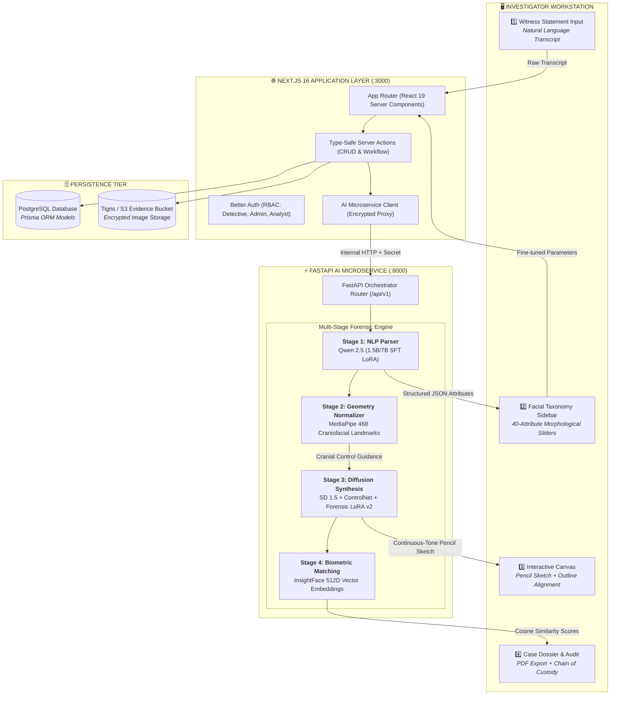

# 🔬 Forensix (Criminal Eye)
### *Next-Generation AI Forensic Composite Synthesis & Biometric Intelligence Platform*

<p align="center">
  
  
  
  
  
  
  
</p>

---

## 📌 Executive Summary

**Forensix (Criminal Eye)** is an enterprise-grade, dual-stack forensic intelligence platform designed for law enforcement agencies, forensic sketch artists, and criminal investigative divisions. 

Traditional witness composite sketching is slow, susceptible to cognitive recall decay, and heavily constrained by artist availability. Forensix addresses this bottleneck by transforming conversational, unstructured witness statements into calibrated, photorealistic forensic pencil composites within seconds.

Built upon a decoupled architecture featuring **Next.js 16 (React 19)** on the presentation layer and a local **FastAPI + PyTorch** microservice on the inference tier, Forensix ensures absolute data sovereignty: **all biometric data, facial models, and investigative records remain 100% on-premise without external cloud API dependencies**.

---

## 🚀 Current Project Phase & Milestones

| Capability / Milestone | Status | Details |
| :--- | :---: | :--- |
| **Stable Diffusion 1.5 Forensic LoRA** | **Completed** | Full **2,000-step** training completed on RTX 4050 6GB; loss converged to **`0.0731`**; saved to [`models/lora/forensic_sketch_lora_v2.safetensors`](ai-service/models/lora/forensic_sketch_lora_v2.safetensors). |
| **Qwen 2.5 SFT Attribute Parser** | **Completed** | Supervised fine-tuning pipeline verified with `trl v1.13+`; trained on 5,000 synthetic witness statements paired with CelebAMask-HQ 40-attribute schemas. |
| **Research Dataset Integration** | **Completed** | **30,000** CelebAMask-HQ high-resolution facial component masks + **2,104** FS2K photo-sketch benchmark pairs fully indexed and preprocessed. |
| **Forensic Sketch Studio (`/sketch`)** | **Completed** | Interactive canvas with outline alignment, 40-attribute taxonomy sidebar, prompt completeness scoring, continuous-tone pencil rendering, and inverted chalkboard mode. |
| **Investigative Case Management** | **Completed** | Case filing, criminal registry, evidence management, and timestamped forensic audit logging. |
| **Biometric Suspect Matching** | **Active** | 512D deep facial embedding extraction via InsightFace / MediaPipe for vector similarity search against registered criminal mugshots. |

---

## 🌟 Key Features

### 🎨 1. Interactive Forensic Sketch Studio (`/sketch`)
* **Natural Language Witness Transcript Processing:** Witnesses describe suspects in their own words; the NLP engine parses terminology into standardized facial anatomy.
* **40-Attribute Craniofacial Taxonomy:** Granular controls for facial shape, eye spacing/tilt, eyebrow arch/thickness, nasal bridge/tip, lip fullness, jawline contour, stubble/beards, and accessories.
* **Cranial Outline Alignment:** Real-time geometric overlay aligning facial landmarks directly against the rendered sketch canvas.
* **Dual Forensic Artistry Modes:**
  * **Graphite on Archival Paper:** Authentic HB/2B pencil sketch with crosshatching and continuous tonal shading.
  * **Chalkboard Inverted:** High-contrast forensic white lineart on black slate for enhanced anatomical feature discrimination.
* **Prompt Completeness Scorer:** Dynamic 0–100% scoring ensuring sufficient morphological detail before diffusion synthesis.

### 🧠 2. Dual-Stage Forensic AI Pipeline
* **Stage 1 (Cognitive Attribute Extraction):** Fine-tuned **Qwen 2.5** extracts 40 observable attributes into an immutable Pydantic JSON schema, completely isolating the system from hallucinated identities.
* **Stage 2 (Forensic Image Synthesis):** **Stable Diffusion 1.5** conditioned with **ControlNet Lineart** and custom **Forensic LoRA v2 (Rank-64)** translates the anatomical parameters into photorealistic forensic sketches.
* **Stage 3 (Biometric Recognition):** Generates **512-dimensional facial feature embeddings** using **InsightFace (`buffalo_l`)** to calculate cosine similarity against registered criminal databases.

### 🛡️ 3. Evidence Integrity & Chain of Custody
* **Cryptographic Audit Log:** Every prompt alteration, slider adjustment, and sketch generation step is immutably logged with timestamps and operator credentials.
* **Strict Facial Privacy:** Zero storage of external celebrity data; strict adherence to ethical forensic boundaries.
* **Exportable Case Dossiers:** Generates courtroom-admissible PDF investigative dossiers containing composite imagery, witness metadata, and similarity matching matrices.

---

## 🧭 System Architecture



---

## 🤖 Deep Learning Model Zoo

| Component | Base Model | Method / Adaptation | Fine-Tuning Dataset | Primary Role | Target Hardware |
| :--- | :--- | :--- | :--- | :--- | :--- |
| **Witness NLP Parser** | `Qwen/Qwen2.5-1.5B-Instruct` | LoRA (Rank 16, Alpha 32) via TRL SFT | 5,000 paired witness statements | Natural language to structured JSON taxonomy | VRAM: ~1.8 GB |
| **Diffusion Backbone** | `runwayml/stable-diffusion-v1-5` | Latent Diffusion (FP16) | Pretrained SD 1.5 weights | Base latent image generation | VRAM: ~2.2 GB |
| **Forensic Adapter** | `forensic_sketch_lora_v2` | LoRA (Rank 64, Alpha 128, 2,000 steps) | CelebAMask-HQ + FS2K (9,208 pairs) | Forensic graphite pencil & shading style | Integrated into SD |
| **Geometry Controller** | `lllyasviel/control_v11p_sd15_lineart` | ControlNet v1.1 (FP16) | Curated facial line drawings | Rigid cranial proportion & outline lock | VRAM: ~1.1 GB |
| **Biometric Embedder** | `InsightFace buffalo_l` | ResNet-100 Deep Metric | Glint360k / WebFace | 512D facial identity vector comparison | VRAM: ~0.8 GB |
| **Landmark Detector** | `MediaPipe Face Landmarker` | BlazeFace Pipeline | Google Landmark Corpus | 468-point 2D/3D cranial landmark extraction | CPU / GPU |

> **VRAM Management:** The pipeline employs sequential execution, FP16 half-precision, and attention slicing to operate seamlessly within a single **6GB VRAM** consumer GPU (NVIDIA GeForce RTX 4050 Laptop).

---

## 🛠️ Technology Stack

```
Frontend:            Next.js 16.3.3 (App Router) • React 19 • TypeScript • Tailwind CSS v4
UI Architecture:     @base-ui/react • Framer Motion • Lucide Icons • Recharts
Authentication:      Better Auth (Session-based, RBAC, Secure Cookie handling)
Database & ORM:      PostgreSQL • Prisma ORM v6 • pgvector
AI & Deep Learning:  PyTorch 2.x (CUDA 12.4) • Diffusers • Transformers • TRL • PEFT
Computer Vision:     OpenCV • MediaPipe • InsightFace • PIL
Microservice:        FastAPI • Uvicorn • Pydantic V2 • HTTPX
Evidence Storage:    AWS S3 / Tigris Object Storage • Presigned URLs
```

---

## 📁 Repository Structure

```text
forensix/
├── src/                                     # Next.js 16 Full-Stack Application Layer
│   ├── app/                                 # App Router (pages, layouts, route handlers)
│   │   ├── (auth)/                          # Authentication (sign-in, sign-up, session)
│   │   ├── dashboard/                       # Cases, Criminal Registry & Audit Hub
│   │   ├── sketch/                          # Forensic Sketch Studio & Canvas
│   │   ├── criminals/                       # Suspect Database & Mugshot Registry
│   │   ├── evidence/                        # Evidence Vault & Custody Chain
│   │   └── api/                             # Server-side route handlers & AI proxy
│   ├── components/                          # UI primitives (@base-ui/react) & case components
│   ├── features/                            # Domain vertical slices (cases, criminals, audit)
│   ├── lib/                                 # Singletons (auth client, db client, logger)
│   └── services/                            # AI microservice client and HTTP contracts
│
├── prisma/                                  # Database Layer (PostgreSQL)
│   ├── schema.prisma                        # Schemas for Cases, Witnesses, Sketches, Criminals
│   └── migrations/                          # Versioned database migrations
│
├── ai-service/                              # Hardware-Optimized FastAPI AI Microservice
│   ├── app/                                 # FastAPI microservice core (/api/v1)
│   │   ├── api/v1/                          # Witness, Sketch & Recognition endpoints
│   │   ├── core/                            # Configuration, logging, auth security
│   │   ├── providers/                       # Local model provider adapters
│   │   ├── schemas/                         # Pydantic V2 validation schemas
│   │   └── services/                        # Orchestration services (sketch, witness, geometry)
│   ├── models/                              # Local model checkpoints
│   │   ├── lora/                            # forensic_sketch_lora_v2.safetensors
│   │   ├── qwen_forensic_adapter/           # Fine-tuned Qwen LoRA adapter
│   │   └── qwen/                            # Local Qwen GGUF weights
│   ├── outputs/                             # Official case output cache
│   ├── datasets/                            # Forensic Research & Training Datasets
│   │   ├── raw/                             # CelebAMask-HQ & FS2K source datasets
│   │   ├── processed/                       # diffusion_train.jsonl & llm_sft_train.jsonl
│   │   └── INSTALLATION_GUIDE.md            # Detailed dataset setup instructions
│   └── scripts/                             # Training & execution scripts
│       ├── train_forensic_lora.py           # 2,000-step SD 1.5 LoRA training engine
│       ├── train_qwen_forensic_sft.py       # TRL Supervised Fine-Tuning script
│       ├── generate_forensic_training_data.py # Dataset generation from raw annotations
│       └── start-all.ps1                    # Microservice launcher
│
├── PROJECT_STRUCTURE.md                     # Deep technical repository layout guide
├── SKETCH_GENERATOR_WORKFLOW.md             # Visual sketch synthesis workflow & sequence diagrams
└── README.md                                # Master repository documentation
```

---

## ⚡ Quick Start & Setup Guide

### 1. Prerequisites
* **Node.js:** `v20.x` or `v22.x` (LTS)
* **Python:** `3.10` or `3.11`
* **GPU:** NVIDIA GPU with CUDA 12.x support (6GB+ VRAM recommended)
* **PostgreSQL:** Local installation or cloud PostgreSQL instance

---

### 2. Application Layer Setup (Next.js)

```powershell
# 1. Clone the repository
git clone https://github.com/your-org/forensix.git
cd forensix

# 2. Install dependencies
npm install

# 3. Configure environment variables
cp .env.example .env
# Edit .env to set your DATABASE_URL, BETTER_AUTH_SECRET, and AI_SERVICE_URL

# 4. Synchronize Prisma Database Schema
npx prisma db push
npx prisma generate

# 5. Launch Next.js Development Server
npm run dev
# Application will be live at http://localhost:3000
```

---

### 3. AI Inference Microservice Setup (FastAPI)

```powershell
# 1. Navigate to the AI service directory
cd ai-service

# 2. Create and activate a Python virtual environment
python -m venv .venv
.\.venv\Scripts\Activate.ps1

# 3. Install core dependencies
pip install --upgrade pip
pip install -r requirements.txt

# 4. Configure microservice environment
cp .env.example .env

# 5. Start the AI service
.\.venv\Scripts\uvicorn app.main:app --host 127.0.0.1 --port 8000 --reload
# Microservice documentation will be available at http://127.0.0.1:8000/docs
```

---

### 4. Running Training & Fine-Tuning Pipelines

If you wish to retrain or fine-tune models on your own facial datasets:

```powershell
cd ai-service

# 1. Generate synchronized training datasets (5,000 paired samples)
.\.venv\Scripts\python scripts/generate_forensic_training_data.py --limit 5000

# 2. Train Stable Diffusion 1.5 LoRA (2,000 steps)
.\.venv\Scripts\python scripts/train_forensic_lora.py `
    --max_train_steps 2000 `
    --batch_size 1 `
    --gradient_accumulation_steps 4 `
    --lora_name forensic_sketch_lora_v2.safetensors

# 3. Fine-Tune Qwen 2.5 on Witness Transcripts (SFT)
.\.venv\Scripts\python scripts/train_qwen_forensic_sft.py `
    --max_steps 200 `
    --batch_size 1 `
    --gradient_accumulation_steps 8
```

---

## 📡 API Reference Overview

The AI Microservice exposes RESTful endpoints secured with shared secret tokens (`X-AI-Secret`):

### `POST /api/v1/witness/process`
Parses free-text witness testimony into structured facial attributes.
```json
// Request Payload
{
  "statement": "The suspect was a male in his late 20s with thick bushy eyebrows, a pointed nose, and short dark hair."
}

// Response
{
  "status": "success",
  "attributes": {
    "gender": "male",
    "estimated_age_range": "25-30",
    "eyebrows": { "thickness": "thick", "shape": "arched" },
    "nose": { "bridge": "straight", "tip": "pointed" },
    "facial_hair": "clean_shaven"
  },
  "confidence_score": 0.94
}
```

### `POST /api/v1/sketch/generate`
Synthesizes a continuous-tone forensic sketch based on calibrated attributes.
```json
// Request Payload
{
  "case_id": "CASE-2026-0492",
  "attributes": { ... },
  "style": "pencil_sketch",
  "steps": 25,
  "guidance_scale": 7.5,
  "seed": 42
}

// Response
{
  "status": "success",
  "sketch_id": "SKETCH-2026-9182",
  "image_url": "/outputs/sketches/CASE-2026-0492_composite.png",
  "generation_time_ms": 3410
}
```

---

## 🔬 Research Datasets & Attribution

Forensix incorporates academic research datasets to ground its morphological models:

1. **CelebAMask-HQ**  
   *30,000 high-resolution images with 19 component segmentation masks.*  
   *Lee, C. H., Liu, Z., Wu, L., & Luo, P. "MaskGAN: Towards Diverse and Interactive Facial Image Manipulation." CVPR 2020.*  
   *Used strictly for non-commercial component parsing and craniofacial geometry normalization.*

2. **FS2K Benchmark**  
   *2,104 paired photo-sketch drawings across diverse sketch drawing styles.*  
   *Fan, D. P., et al. "FS2K: Two Thousand Facial Sketches." IEEE Transactions on Pattern Analysis and Machine Intelligence, 2022.*  
   *Used for photo-to-sketch translation and lineart domain validation.*

> *For complete dataset installation instructions and directory requirements, see [`ai-service/datasets/INSTALLATION_GUIDE.md`](ai-service/datasets/INSTALLATION_GUIDE.md).*

---

## ⚖️ Forensic Ethics & Responsible AI

* **Non-Prejudicial Representation:** Default outputs adhere to neutral expressions, standardized lighting, and anatomical symmetry to avoid biasing witness line-up procedures.
* **No Predictive Guilt:** Forensix is strictly an investigative assistance tool for generating composite representations based on eyewitness recall. It **never** predicts criminal tendency, guilt, or identity.
* **Human-in-the-Loop:** All composite outputs require verification and sign-off by a qualified forensic investigator or sketch artist prior to public release.

---

## 📄 License & Contact

Distributed under an **Enterprise Research & Development License**.  
For inquiries, law enforcement trials, or technical support, please open an issue in this repository.

<p align="center">
  <b>Forensix Intelligence Systems</b> • <i>Precision Forensic AI for Law Enforcement</i>
</p>
