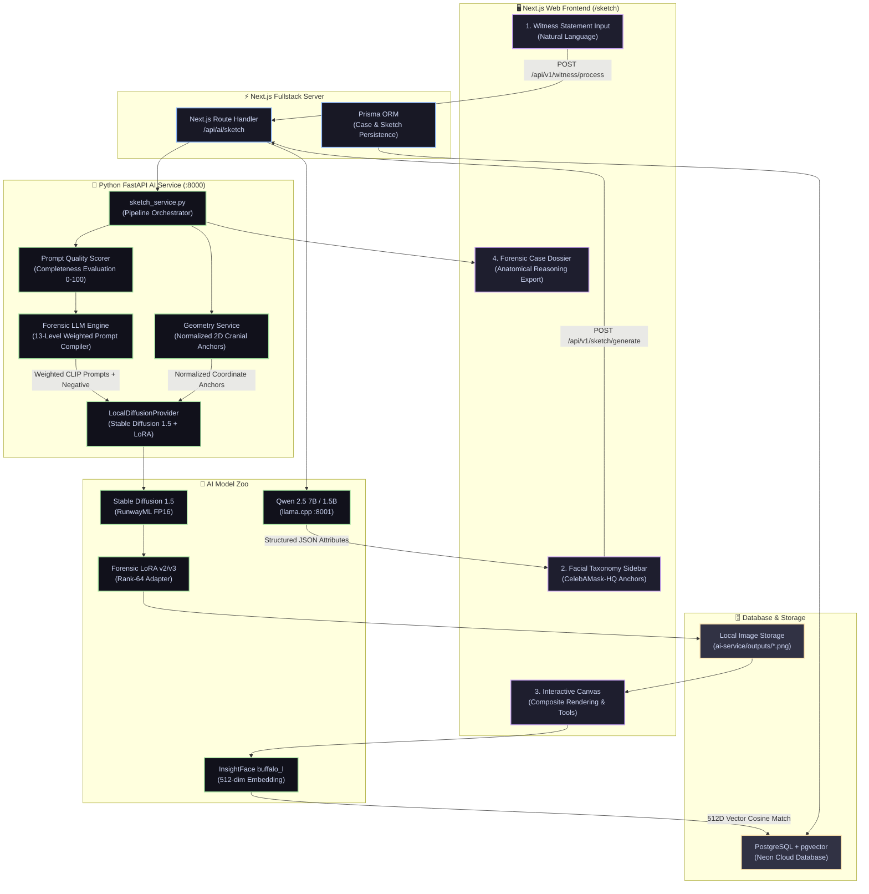

# 🔬 Forensix — Sketch Generator Architecture & Flow Guide

> **A comprehensive visual and technical breakdown of how the Forensix Sketch Generator works, every AI model involved, and how witness statements are transformed into forensic-grade police composite sketches.**

---

## 📑 Table of Contents
1. [High-Level Architectural Flowchart](#1-high-level-architectural-flowchart)
2. [End-to-End Sequence Diagram](#2-end-to-end-sequence-diagram)
3. [Every AI Model Involved (Directory & Role)](#3-every-ai-model-involved)
4. [Step-by-Step UI & Data Transformation Flow](#4-step-by-step-ui--data-transformation-flow)
5. [Concrete Walkthrough: From Witness Words to Composite Sketch](#5-concrete-walkthrough)
6. [Hardware & VRAM Optimization (RTX 4050 6GB)](#6-hardware--vram-optimization)

---

## 1. High-Level Architectural Flowchart



---

## 2. End-to-End Sequence Diagram

```mermaid
sequenceDiagram
    autonumber
    actor Investigator as 👮 Investigator / Witness
    participant UI as 🖥️ Next.js UI (/sketch)
    participant NextAPI as 🌐 Next.js API (/api/ai/sketch)
    participant FastAPI as ⚡ FastAPI Service (:8000)
    participant LLM as 💬 Qwen 2.5 LLM (:8001)
    participant Engine as 📐 Forensic Prompt & Geometry Engine
    participant SD as 🎨 Stable Diffusion 1.5 + LoRA

    Investigator->>UI: 1. Types natural language description<br/>("Male, late 20s, sharp jaw, pointy nose, bushy eyebrows, stubble...")
    UI->>FastAPI: 2. POST /api/v1/witness/process
    FastAPI->>LLM: 3. Sends statement with Forensic Taxonomy System Prompt
    LLM-->>FastAPI: 4. Returns JSON: {face_shape: "oval", jaw: "angular", nose: "pointed", beard: "stubble"}
    FastAPI-->>UI: 5. Populates Sidebar dropdowns & sliders with extracted attributes

    Investigator->>UI: 6. Fine-tunes attributes in Sidebar (e.g. adjusts eye tilt, hair style)
    Investigator->>UI: 7. Clicks "Synthesize Forensic Sketch"
    UI->>NextAPI: 8. POST /api/ai/sketch with parameters
    NextAPI->>FastAPI: 9. Forwards to /api/v1/sketch/generate

    rect rgb(24, 24, 37)
        Note over FastAPI,Engine: Stage A: Prompt Scoring & Enrichment
        FastAPI->>Engine: Evaluates prompt completeness (0-100) & injects missing anatomical traits
        Note over FastAPI,Engine: Stage B: Forensic Reasoning & Prompt Compilation
        FastAPI->>Engine: Compiles 13-Level Priority Prompt with calibrated attention weights:<br/>(oval face:1.3), (thick bushy eyebrows:1.35), (pointed sharp nose:1.35)...
        Note over FastAPI,Engine: Stage C: 2D Geometry Normalization
        FastAPI->>Engine: Calculates normalized (x,y) anchors for eyes, nose, lips, jawline based on CelebAMask-HQ
    end

    FastAPI->>SD: 10. Dispatches Positive Prompt, Negative Prompt, Seed, DDIM Steps (28), CFG (9.0)
    Note over SD: Denoises 512x512 latent space<br/>guided by Forensic LoRA (FS2K + CelebAMask-HQ)
    SD-->>FastAPI: 11. Emits high-fidelity graphite pencil sketch (.png)

    FastAPI-->>NextAPI: 12. Returns image URL, metadata, and anatomical reasoning report
    NextAPI-->>UI: 13. Renders composite drawing on Interactive Canvas
    UI-->>Investigator: 14. Displays Sketch, Quality Score, and Full Investigative Dossier
```



---

## 3. Every AI Model Involved

| # | Model Name | Model Type | Weight / Format | Role in Forensix | File Location |
|---|---|---|---|---|---|
| **1** | **Qwen 2.5 7B Instruct** | Large Language Model (LLM) | 4.68 GB (`.gguf` Q4_K_M) | **Witness Statement NLP Parsing**: Converts messy witness statements into structured anatomical JSON. | [`models/qwen/`](file:///d:/Madhan%20Kumar/Web%20Development%20Projects/forensix/ai-service/models/qwen/) |
| **2** | **Forensic LLM Engine v3** | Rule & Reasoning Engine | Python AST Engine | **13-Level Priority Prompt Compiler**: Maps attributes to weighted CLIP tokens (`(sharp chiseled jawline:1.3)`), builds negative prompts, and computes CFG/steps. | [`forensic_llm_engine.py`](file:///d:/Madhan%20Kumar/Web%20Development%20Projects/forensix/ai-service/app/services/forensic_llm_engine.py) |
| **3** | **Prompt Quality Scorer** | NLP Heuristic & Quality Evaluator | Python Rule Engine | **Witness Completeness Scoring**: Evaluates witness descriptions on a 0–100 scale, detects missing facial features, and auto-enriches sparse inputs. | [`prompt_quality_scorer.py`](file:///d:/Madhan%20Kumar/Web%20Development%20Projects/forensix/ai-service/app/services/prompt_quality_scorer.py) |
| **4** | **Geometry Service** | Coordinate Normalization Engine | Python Morphometric Model | **CelebAMask-HQ 2D Anchors**: Calculates normalized (x,y) facial landmarks (nasion, philtrum, ocular width, gonial jawline angle). | [`geometry_service.py`](file:///d:/Madhan%20Kumar/Web%20Development%20Projects/forensix/ai-service/app/services/geometry_service.py) |
| **5** | **Stable Diffusion 1.5** | Latent Diffusion Model | 3.97 GB (FP16 `.safetensors`) | **Base Image Synthesizer**: Generates 512×512 composite images via DDIM denoising scheduler in FP16 precision. | [`models/sd15/`](file:///d:/Madhan%20Kumar/Web%20Development%20Projects/forensix/ai-service/models/sd15/) |
| **6** | **Forensic LoRA v2 / v3** | Low-Rank Adaptation Adapter | 51 MB (`.safetensors`, Rank-64) | **Forensic Sketch Style & Anatomy Binder**: Fine-tuned on **FS2K sketches** + **CelebAMask-HQ 40 attributes** to force 2B pencil graphite linework and bind words to exact visual traits. | [`models/lora/`](file:///d:/Madhan%20Kumar/Web%20Development%20Projects/forensix/ai-service/models/lora/) |
| **7** | **ControlNet Lineart** *(Optional)* | Conditioning Neural Network | 1.45 GB (`.safetensors`) | **Structural Lineart Guidance**: Guides pixel generation strictly along 2D landmark contours when lineart conditioning is enabled. | [`models/controlnet/lineart/`](file:///d:/Madhan%20Kumar/Web%20Development%20Projects/forensix/ai-service/models/controlnet/lineart/) |
| **8** | **InsightFace (buffalo_l)** | Facial Recognition & Biometric Extractor | ONNX Models (`w600k_r50`) | **Suspect Search & Face Matching**: Generates 512-dimensional facial identity vectors from the sketch to query known suspects in PostgreSQL via pgvector. | [`models/insightface/`](file:///d:/Madhan%20Kumar/Web%20Development%20Projects/forensix/ai-service/models/insightface/) |

---

## 4. Step-by-Step UI & Data Transformation Flow

### Step 1: Witness Statement Ingestion (`witness-statement-card.tsx`)
* The investigator types the witness description into a natural language text box.
* Clicking **"Extract Facial Features"** calls `/api/v1/witness/process`.
* **Qwen 2.5** extracts structured traits:
  ```json
  {
    "gender": "male",
    "face_shape": "oval",
    "eyebrows": {"thickness": "thick", "shape": "arched"},
    "nose": {"tip": "pointed", "bridge": "straight"},
    "facial_hair": "5_o_clock_shadow"
  }
  ```

### Step 2: Facial Taxonomy Sidebar (`facial-attributes-editor.tsx`)
* The UI displays the **CelebAMask-HQ Anchors** sidebar.
* The extracted traits automatically pre-fill the dropdowns:
  * *Face Structure / Jawline:* Oval, Square, Round, Oblong, Diamond, Heart
  * *Eye Anatomy:* Almond, Round, Narrow, Deep-Set, Wide-Set, Close-Set
  * *Nose Contour:* Straight, Roman, Upturned, Broad, Bulbous, Pointed
  * *Mouth & Lip Volume:* Full, Thin, Medium, Cupid's Bow, Wide
  * *Facial Hair:* Clean-shaven, 5 o'clock shadow, Full beard, Goatee, Mustache
  * *Accessories:* Eyeglasses, Sunglasses, Baseball cap, Beanie
* The investigator can fine-tune any dropdown according to additional witness clarification.

### Step 3: Synthesis Parameters & Prompt Compilation
* In the background, [`forensic_llm_engine.py`](file:///d:/Madhan%20Kumar/Web%20Development%20Projects/forensix/ai-service/app/services/forensic_llm_engine.py) compiles the prompt into a **13-Level Priority Hierarchy**:
  1. **Rendering Medium:** `(forensic graphite pencil sketch:1.4), 2B pencil hatching...`
  2. **Camera Perspective:** `front-facing portrait, direct gaze, symmetrical...`
  3. **Face Shape:** `(oval-shaped face:1.3), balanced cranial proportions...`
  4. **Eye Region:** `(narrow eyes:1.35), (thick bushy eyebrows:1.35)...`
  5. **Nose Region:** `(pointed sharp nose:1.35), slender elongated nasal tip...`
  6. **Mouth & Lips:** `(full voluminous lips:1.3), defined Cupid's bow...`
  7. **Facial Hair / Stubble:** `(heavy 5 o'clock shadow stubble:1.35)...`
  8. **Negative Prompt:** Suppresses photo realism, colors, 3D renders, facial seams, and caricatures.

### Step 4: Diffusion Synthesis & Dossier Rendering (`composite-output-preview.tsx`)
* **Stable Diffusion 1.5** loads the **Rank-64 Forensic LoRA** adapter.
* Denoises the latent tensor over 28 DDIM steps (standard) or 45 steps (master).
* The resulting sketch appears on the interactive canvas with:
  * **Zoom / Pan / Inspect controls**
  * **Interactive Landmark Overlay** showing exact alignment points
  * **Forensic Confidence Score** & Prompt Completeness Gauge (0–100%)
  * **Investigator Dossier Export** (PDF / Case Report)

---

## 5. Concrete Walkthrough: From Witness Words to Composite Sketch

```
[Witness Statement]
"He was a young male in his late 20s. He had a sharp chiseled jaw, thick bushy eyebrows,
narrow eyes, a sharp pointed nose, and dark stubble along his beard line."
                                  │
                                  ▼
[Qwen 2.5 LLM Extraction]
{
  "gender": "male",
  "estimated_age_range": "20-30",
  "face_shape": "square",
  "eyebrows": {"thickness": "thick"},
  "eyes": {"shape": "narrow"},
  "nose": {"tip": "pointed"},
  "facial_hair": "5_o_clock_shadow"
}
                                  │
                                  ▼
[Forensic LLM Engine Compilation]
POSITIVE PROMPT:
"authentic police forensic composite sketch, fine 2B graphite pencil cross-hatching,
official law enforcement forensic drawing, (square strong jawline:1.3), horizontal mandibular base,
(thick bushy eyebrows:1.35), dense heavy brow hair texture, (narrow slender eyes:1.35),
(pointed sharp nose:1.35), slender elongated nasal tip, (heavy 5 o'clock shadow:1.35),
dark stubble across jawline and chin, forensic facial composite of an adult male,
paper grain texture, neutral white background, head and neck and upper shoulder area only"

NEGATIVE PROMPT:
"(frame:1.5), (border:1.5), (seam:1.8), (robot:1.8), (color:1.5), (photograph:1.5),
(photorealistic:1.5), (3d render:1.3), (smile:1.3), deformed, bad anatomy, blurry"
                                  │
                                  ▼
[SD 1.5 + Forensic LoRA Denoising]
Loads UNet + LoRA weights -> DDIM Scheduler (28 steps, CFG=9.0) -> VAE Decode
                                  │
                                  ▼
[Final Composite Sketch]
High-precision 512x512 pencil sketch showing the exact requested masculine jawline,
bushy brows, narrow eyes, pointed nose tip, and realistic 5 o'clock shadow!
```

---

## 6. Hardware & VRAM Optimization (RTX 4050 6GB)

Forensix is engineered to run seamlessly on consumer laptop GPUs (6GB VRAM):

1. **FP16 Half-Precision:** SD 1.5 and LoRA weights run entirely in FP16, cutting VRAM usage by 50% compared to FP32.
2. **Model CPU Offloading:** Components not currently computing (e.g. Text Encoder, VAE) are automatically offloaded to system RAM, keeping peak VRAM under **4.8 GB**.
3. **Attention Slicing:** Multi-head attention computation is sliced into sequential chunks, eliminating memory spikes during high-resolution latent decoding.
4. **Quantized LLM (GGUF Q4_K_M):** Qwen runs in 4-bit quantization via `llama.cpp` on port 8001, consuming only ~4.5 GB of system/GPU memory.

---

> [!TIP]
> **Summary:** The Sketch Generator is a **two-stage cognitive pipeline**:
> 1. **The Brain (LLM):** Understands human witness language and translates it into anatomical mathematics and weighted prompts.
> 2. **The Hand (SD 1.5 + LoRA):** Executes the drawing with forensic accuracy, guided by genuine police sketch datasets (FS2K) and facial segmentation landmarks (CelebAMask-HQ).
