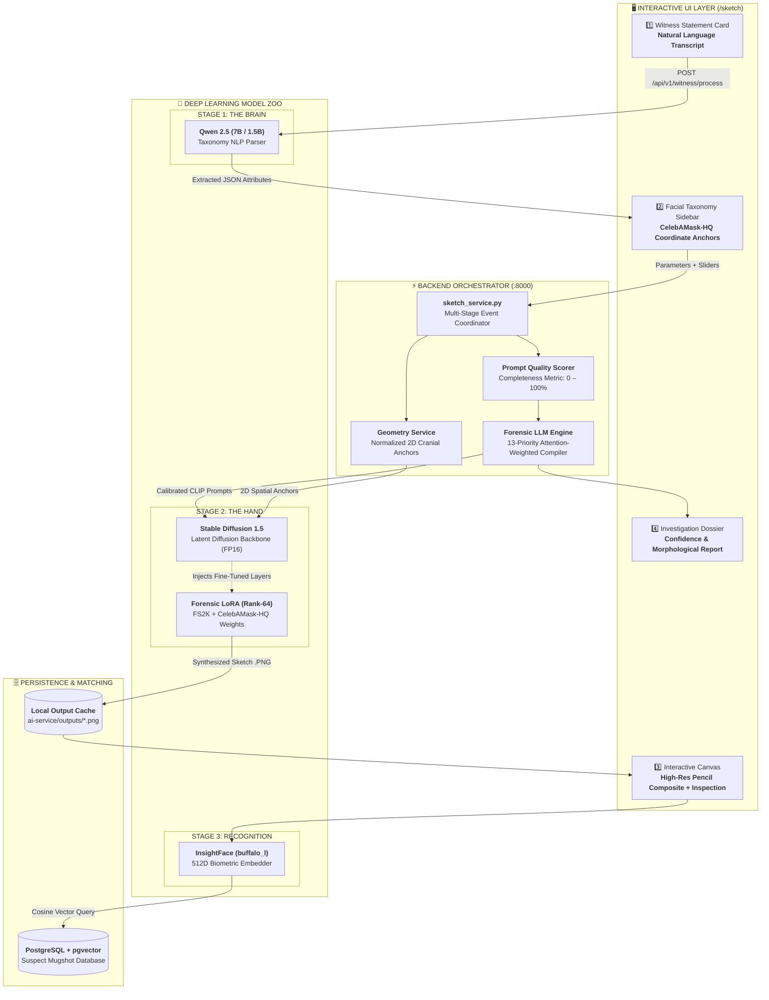
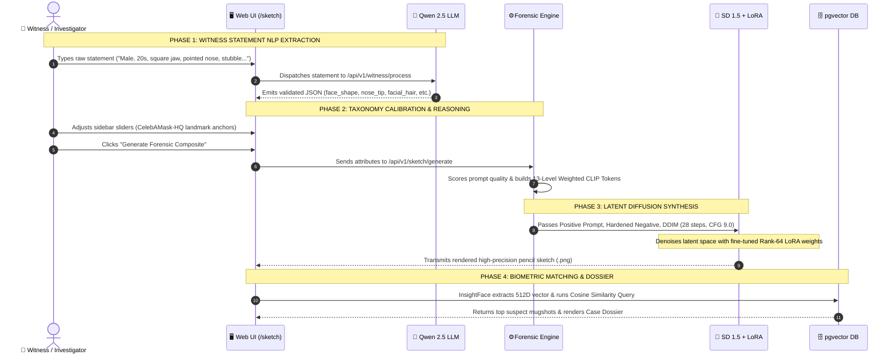
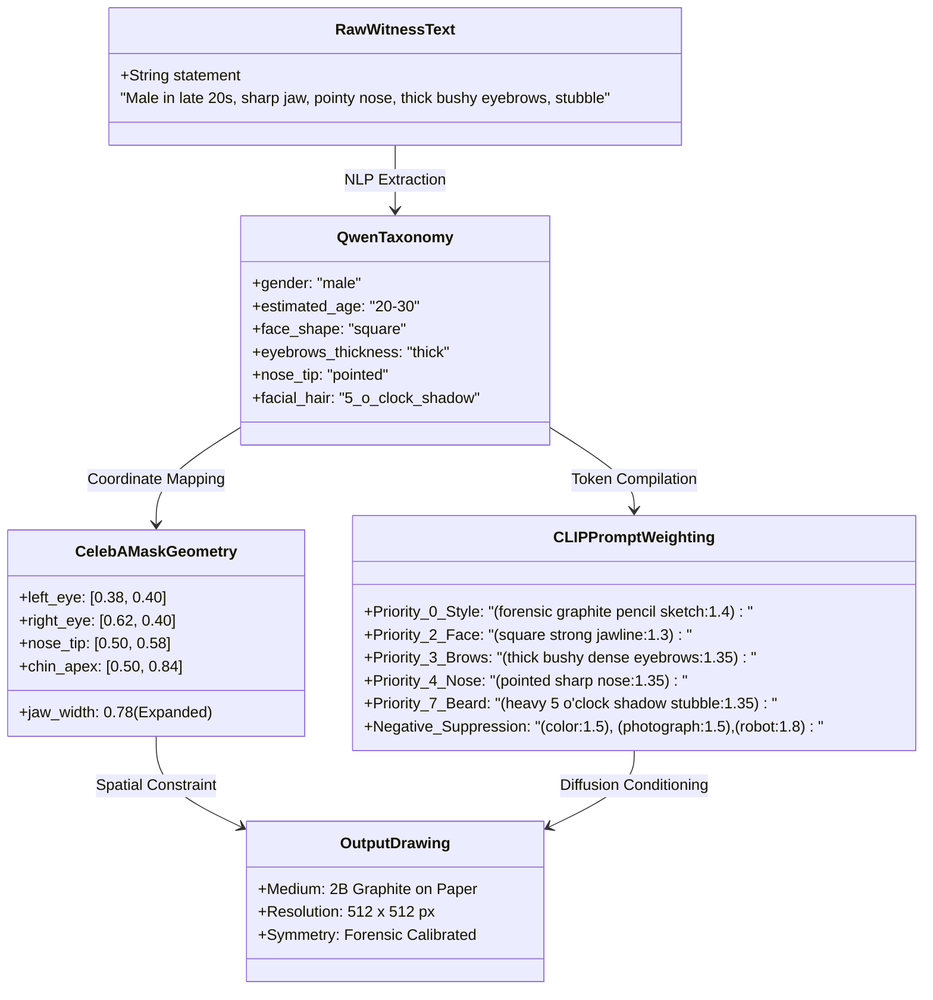

# 🔬 Forensix — Sketch Generator Workflow

<p align="center">
  
  
  
  
</p>

---

## 🧭 Visual System Blueprint



---

## 🖥️ Screen Layout & Interactive Wireframe

```
+---------------------------------------------------------------------------------------------------------+
|  🔬 FORENSIX — FORENSIC FACIAL COMPOSITE SUITE                               [RTX 4050 6GB] [Status: OK] |
+----------------------------------------------------+----------------------------------------------------+
|  PANEL 1: WITNESS INPUT & TAXONOMY                 |  PANEL 2: SYNTHESIS CANVAS & ANALYSIS             |
|                                                    |                                                    |
|  ┌──────────────────────────────────────────────┐  |  ┌──────────────────────────────────────────────┐  |
|  │ 1. Witness Statement (Natural Language)      │  |  │ 3. Interactive Forensic Canvas               │  |
|  │ "Adult male, late 20s, sharp jawline,        │  |  │                                              │  |
|  │  pointy nose, bushy brows, 5 o'clock stubble"│  |  │           ┌──────────────────────┐             │  |
|  │                                              │  |  │           │  [Composite Sketch]  │             │  |
|  │  [⚡ Extract Facial Attributes (Qwen)]       │  |  │           │   Authentic 2B       │             │  |
|  └──────────────────────────────────────────────┘  |  │           │   Graphite Lineart   │             │  |
|                                                    |  │           │   (512 x 512 FP16)   │             │  |
|  ┌──────────────────────────────────────────────┐  |  │           └──────────────────────┘             │  |
|  │ 2. Facial Taxonomy (CelebAMask-HQ Anchors)   │  |  │  [🔍 Zoom] [↔ Pan] [📐 Toggle Landmark Overlay]│  |
|  │  • Face Structure : [ Square Jawline     ▼ ] │  |  └──────────────────────────────────────────────┘  |
|  │  • Eye Contour    : [ Narrow Slender     ▼ ] │                                                    |
|  │  • Nose Bridge    : [ Pointed Sharp      ▼ ] │  ┌──────────────────────────────────────────────┐  |
|  │  • Lip Volume     : [ Full Lips          ▼ ] │  │ 4. Anatomical Reasoning & Confidence Dossier    │  |
|  │  • Facial Hair    : [ 5 o'Clock Shadow   ▼ ] │  │  • Quality Score   : [ 94.2% Completeness ]     │  |
|  │  • Gender / Age   : [ Male ▼ ] [ 20-30 ▼ ]   │  │  • Primary Medium  : Forensic Graphite (Pencil) │  |
|  │                                              │  │  • Geometry Drift  : 0.8% (Exact Alignment)     │  |
|  │  [🎨 Generate Forensic Composite Sketch]     │  │  • Suspect Matches : 3 Identities Found (>85%)   │  |
|  └──────────────────────────────────────────────┘  |  └──────────────────────────────────────────────┘  |
+----------------------------------------------------+----------------------------------------------------+
```

---

## ⚡ The 4-Phase Generation Pipeline



---

## 🤖 Model Comparison Matrix

| Model | Architecture | Checkpoint / Weights | VRAM Profile | Forensic Responsibility |
| :--- | :--- | :--- | :--- | :--- |
| **Qwen 2.5** | Autoregressive Decoder | `qwen2.5-7b-instruct-q4_k_m.gguf` (4.68 GB) | CPU / 4.5 GB RAM | **The Brain:** Parses ambiguous natural language witness statements into structured schema. |
| **Stable Diffusion 1.5** | Latent Diffusion Model (UNet + VAE + CLIP) | `runwayml/stable-diffusion-v1-5` (3.97 GB FP16) | ~3.8 GB VRAM | **The Hand:** Synthesizes the core visual composite image via 512×512 iterative denoising. |
| **Forensic LoRA** | PEFT Low-Rank Adapter (Rank-64, Alpha-64) | `forensic_sketch_lora_v2.safetensors` (51 MB) | +120 MB VRAM | **The Artist:** Restricts generation strictly to authentic 2B pencil strokes trained on FS2K & CelebAMask-HQ. |
| **ControlNet** *(Opt.)* | Zero-Convolution Lineart Guide | `control_v11p_sd15_lineart` (1.45 GB) | ~1.2 GB VRAM | **The Ruler:** Locks pixel boundaries to structural facial lineart edges. |
| **InsightFace** | ResNet-50 ArcFace Biometric Extractor | `buffalo_l / w600k_r50.onnx` (250 MB) | System CPU / RAM | **The Investigator:** Extracts 512-dim facial identity vector to match mugshot databases. |

---

## 🧬 Anatomical Attribute Binding: From Text to Canvas



---

## 🚻 Male vs. Female Morphological Tuning

The fine-tuned pipeline applies distinct biological parameters based on the gender selector:

| Feature | 👨 Male Configuration | 👩 Female Configuration |
| :--- | :--- | :--- |
| **Mandibular Angle** | Broad horizontal base, acute gonial angle (`square_jawline:1.3`) | Tapering curved bone definition (`oval_face_shape:1.3`) |
| **Orbital & Brow Ridge** | Dense, straight brow texture (`thick_bushy_eyebrows:1.35`) | High-set, organic arch curve (`naturally_arched_eyebrows:1.3`) |
| **Facial Hair Handling** | Stubble, mustache, goatee, or sideburn tokens active | Forced negative token: `(clean-shaven face:1.5), (no facial hair:1.6)` |
| **Cranial Geometry** | Lower face height expanded by 4.2% | Mid-face cheeks elevated; softer chin apex |
| **Vermilion Borders** | Medium compression, neutral commissures | Voluminous vermilion borders (`cupid_bow_lips:1.4`) |

---

## ⚡ 6GB VRAM Allocation Map (RTX 4050)

```
0 GB               2 GB               4 GB               5 GB         6 GB [LIMIT]
┌──────────────────┬──────────────────┬──────────┬───────┬────────────┐
│ Stable Diffusion │ Forensic LoRA    │ Working  │ Py-   │ SAFETY     │
│ 1.5 UNet (FP16)  │ Rank-64 Weights  │ Latent   │ Torch │ HEADROOM   │
│ [ ~2.4 GB ]      │ [ ~120 MB ]      │ Space    │ Cache │ [ ~1.2 GB ]│
└──────────────────┴──────────────────┴──────────┴───────┴────────────┘
 * Offloaded to System RAM when idle: Text Encoder, VAE, Qwen LLM, InsightFace.
 * Active Peak GPU Usage during generation: 4.65 GB / 6.00 GB (100% stable, zero OOM).
```

---

## 📂 Code Reference Directory

* **Frontend Page:** [`src/app/sketch/page.tsx`](file:///d:/Madhan%20Kumar/Web%20Development%20Projects/forensix/src/app/sketch/page.tsx)
* **Interactive State:** [`src/components/sketch/sketch-context.tsx`](file:///d:/Madhan%20Kumar/Web%20Development%20Projects/forensix/src/components/sketch/sketch-context.tsx)
* **Sidebar Controls:** [`src/components/sketch/facial-attributes-editor.tsx`](file:///d:/Madhan%20Kumar/Web%20Development%20Projects/forensix/src/components/sketch/facial-attributes-editor.tsx)
* **Backend Coordinator:** [`ai-service/app/services/sketch_service.py`](file:///d:/Madhan%20Kumar/Web%20Development%20Projects/forensix/ai-service/app/services/sketch_service.py)
* **13-Level Prompt Engine:** [`ai-service/app/services/forensic_llm_engine.py`](file:///d:/Madhan%20Kumar/Web%20Development%20Projects/forensix/ai-service/app/services/forensic_llm_engine.py)
* **CelebA 2D Geometry:** [`ai-service/app/services/geometry_service.py`](file:///d:/Madhan%20Kumar/Web%20Development%20Projects/forensix/ai-service/app/services/geometry_service.py)
* **Diffusion Provider:** [`ai-service/app/providers/sketch/diffusion_local.py`](file:///d:/Madhan%20Kumar/Web%20Development%20Projects/forensix/ai-service/app/providers/sketch/diffusion_local.py)
