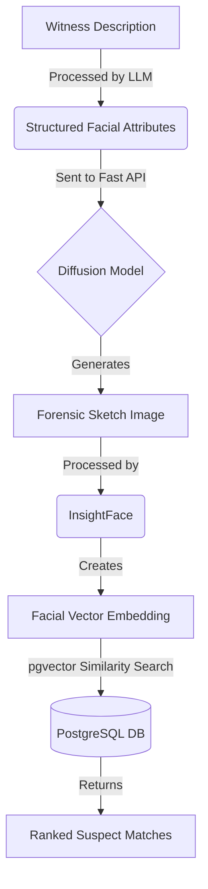

# Forensix (Criminal Eye) - Project Architecture & Workflow

> [!NOTE]
> This document outlines the structural foundation of the Forensix platform. It explains the purpose of the core navigational routes, the UI components required for each page, and the underlying AI pipeline that powers the system.

Forensix is an AI-powered forensic sketch generation and criminal face recognition system designed for modern law enforcement and investigation agencies. It features a premium, minimal dark-mode aesthetic built on Next.js 16, Tailwind CSS v4, and Shadcn UI.

---

## Core Pages & Components

The primary navigation header links to four foundational pages. Currently, these are placeholder layouts, but as development progresses (per the project roadmap), they will be populated with complex interactive components.

### 1. Cases (`/cases`)
**Purpose**: A centralized hub for investigators to create, update, and manage ongoing investigation records and associate them with witness statements and evidence.

**Components to be built:**
*   **Data Tables**: Complex, sortable, and filterable tables (using Shadcn's Table component and TanStack Table) to list active and closed cases.
*   **CRUD Dialogs**: Modal windows (`<Dialog />`) containing forms to create new cases.
*   **Witness Profiles**: Accordions or collapsible cards detailing witness statements.

### 2. Criminal Database (`/criminals`)
**Purpose**: A secure, searchable repository of known offenders, storing their demographic data alongside vector embeddings of their faces for rapid similarity searches.

**Components to be built:**
*   **Search & Filter Bar**: Advanced input fields with debounced searching.
*   **Profile Cards**: Grid layouts of `<Card />` components displaying mugshots and vital statistics.
*   **Upload Zones**: Drag-and-drop areas for uploading new offender photos to be processed by the facial recognition backend.

### 3. Sketch Generator (`/sketch`)
**Purpose**: The core AI feature of the application. It allows investigators to input natural language descriptions provided by witnesses and generates highly realistic forensic sketches.

**Components to be built:**
*   **Prompt Interface**: A chat-like text area or a structured, multi-step form (`<Form />` powered by React Hook Form + Zod) for gathering suspect attributes (e.g., eye color, jaw shape, hair type).
*   **Image Gallery**: A carousel or grid to display the variations of sketches generated by the AI diffusion model.
*   **Action Bar**: Buttons to "Refine Sketch", "Save to Case", or "Run Face Match".

### 4. Dashboard (`/admin`)
**Purpose**: An administrative overview for managing the platform, monitoring system usage, and reviewing audit logs.

**Components to be built:**
*   **KPI Metrics**: Summary cards showing metrics like "Total Cases", "Sketches Generated Today", and "Matches Found".
*   **Recent Activity Feed**: A scrollable list tracking user actions (e.g., "Officer Smith generated a sketch").
*   **Role Management**: Interfaces to assign permissions (Admin, Investigator, Officer).

---

## How the Project Works (The AI Pipeline)

Behind the premium UI, the system relies on a sophisticated, multi-stage backend pipeline:

1.  **Attribute Extraction**: A witness provides a natural language description. An LLM (Large Language Model) parses this text into structured attributes.
2.  **Sketch Generation**: These attributes are fed into an AI diffusion model via a dedicated Python FastAPI service, which produces a realistic sketch.
3.  **Facial Embedding**: The generated sketch is processed by the **InsightFace** library, which maps the facial features into a mathematical vector representation (an embedding).
4.  **Similarity Search**: The embedding is compared against the database of known criminals using **pgvector** in PostgreSQL.
5.  **Match Resolution**: The system returns a ranked list of potential suspects with confidence scores, allowing investigators to generate downloadable PDF reports.
